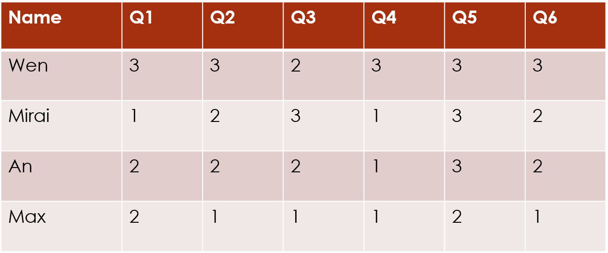

# \`clustord\` Ordinal Models

## **TL:DR**

The proportional-odds model is named `"POM"` in the
[`clustord()`](https://vuw-clustering.github.io/clustord/reference/clustord.md)
model argument. It is the most commonly-used model for ordinal data
analysis, and it is the simplest, in that it has the fewest parameters
and a consistent pattern for all categories of the ordinal response
variables.

The ordered stereotype model is named `"OSM"` in the
[`clustord()`](https://vuw-clustering.github.io/clustord/reference/clustord.md)
model argument. Compared with the proportional-odds model, it has one
additional parameter for every category/level of the ordinal response
variable. These additional parameters, plus its non-cumulative
structure, make it much more flexible. Use the OSM if you think that
your ordinal data may be very heterogeneous in terms of the patterns of
different categories of the response variables.

The $\texttt{𝚙𝚑𝚒}_{k}$ score parameters for the response categories $k$
indicate how much information is available in each response category. If
$\texttt{𝚙𝚑𝚒}_{k}$ and $\texttt{𝚙𝚑𝚒}_{k + 1}$ are very similar (within
0.1 of each other) then that indicates that response categories $k$ and
$k + 1$ do not provide much information about any clustering structure,
which means you could simplify your data by combining those two response
categories without having much effect on the results of the analysis.

You can also use the $\texttt{𝚙𝚑𝚒}_{k}$ scores from the OSM as a
data-driven numerical encoding of your ordinal response categories that
is better than simply numbering the categories $1,2,\ldots,q$ and then
carry out analysis using methods for numerical data, such as k-means
(Lloyd, 1982 and MacQueen, 1967).

## Introduction

For this package, we assume that you have a dataset of ordinal data. The
most common form of this is survey data, such as you might get by asking
participants to ask a series of questions with Likert-scale answers (for
example, ranking from 1 = “Strongly Disagree” to 5 = “Strongly Agree”).

We will refer to the data matrix as $\mathbf{Y}$. We index the rows of
the data matrix with $i$ and the columns of the data matrix with $j$, so
an individual response value is defined as $Y_{ij}$. The $q$ categories
of each response variable $Y_{ij}$ are indexed with $k$, with
$k = 1,\ldots,q$.

There are three broad types of clustering: row clustering, column
clustering and biclustering. Within each of these, there are multiple
possible clustering structures. These are discussed in detail in the
*`clustord` Tutorial* vignette, and summarised in the *Clustering
Structure Summary* vignette.

If there are row clusters, they are indexed with $r$ and if there are
column clusters they are indexed with $c$.

This vignette discusses the two types of ordinal models that are
available in `clustord`: the **proportional-odds model (POM)** and the
**ordered stereotype model (OSM)**.

## Proportional-odds model (POM)

The first model is the proportional-odds model (Agresti, 2000). This is
the most widely-used ordinal model, and the simplest. The model is more
easily recognisable as a regression model:
$$\text{logit}P\left( Y \leq k\,|\,\mathbf{x} \right) = \log\left( \frac{P\left( Y \leq k\,|\,\mathbf{x} \right)}{P\left( Y > k\,|\,\mathbf{x} \right)} \right) = \mu_{k} - {\mathbf{β}}^{T}\mathbf{x}\;\;\text{for}\; k = 1,\ldots,q - 1$$
where $\mu_{k}$ is the intercept parameter for response category $k$ and
$\mathbf{β}$ are the coefficients controlling the effect of $\mathbf{x}$
on the response, $Y$. The model is named “proportional-odds” because the
coefficients do not depend on the response category, $k$. That is, the
effect of $\mathbf{x}$ is the same for every single category of the
response. Thus, the number of coefficients is only one more than the
number of covariates.

This is also a **cumulative** ordinal model in that it is expressed as
the probability of obtaining a given response category or lower,
relative to the probability of getting any of the higher response
categories. Along with the coefficients staying the same for all
categories, this is the other part of how this model enforces similar
patterns of effects for every response category.

The proportional-odds clustering forms in `clustord` were introduced in
Matechou et al. (2016). Considering cell $(i,j)$ in the data matrix of
responses, where if row $i$ is in row cluster $r$ and/or column $j$ is
in column $c$ then the model has this general shape:
$$\log\left( \frac{P\left( Y_{ij} \leq k\,|\, i \in r,\; j \in c \right)}{P\left( Y_{ij} > k\,|\, i \in r,\; j \in c \right)} \right) = \mu_{k} - \eta_{rcij}\;\;\text{for}\; k = 1,\ldots,q - 1$$
where $\mu_{k}$ is a parameter that controls the default probabilities
of the different response categories in the absence of clustering, and
$\eta_{rcij}$ is the remaining part of the linear predictor.
$\eta_{rcij}$ is the part of the model that determines the clustering
structure, and it is the same in both the proportional-odds model and
the ordered stereotype model within `clustord`.

$\eta_{rcij}$ is subtracted from $\mu_{k}$, rather than added, so that
if a parameter within $\eta_{rcij}$ is positive then that corresponds to
a higher probability of obtaining higher response categories (whereas if
it were added, positive effects would lead to a higher probability of
obtaining lower response categories).

The logit notation above is the most compact way of expressing this
model, but alternatively we can express it in terms of the probability,
$\theta_{ijk}$, of getting a single response category, $k$, in cell
$Y_{ij}$: $$\theta_{ijk}\,|\, i \in r,\; j \in c = \begin{cases}
\frac{\exp\left( \mu_{k} - \eta_{rcij} \right)}{1 + \exp\left( \mu_{k} - \eta_{rcij} \right)} & {k = 1} \\
{\frac{\exp\left( \mu_{k} - \eta_{rcij} \right)}{1 + \exp\left( \mu_{k} - \eta_{rcij} \right)} - \frac{\exp\left( \mu_{k - 1} - \eta_{rcij} \right)}{1 + \exp\left( \mu_{k - 1} - \eta_{rcij} \right)}} & {1 < k < q} \\
{1 - \sum\limits_{k = 1}^{q - 1}\theta_{ijk}} & {k = q}
\end{cases}$$

These are some of the potential clustering structures within `clustord`,
expressed in POM form:

Column clustering and biclustering can similarly include covariates, in
the same way as row clustering can. Note that because the
coefficient/covariate structure of including covariates is the same in
the clustering models regardless of whether the covariates are attached
to the rows ($\mathbf{x}_{i}$) or the columns ($\mathbf{w}_{j}$), the
`clustord` package combines their coefficients into one single `cov`
parameter vector, with the order of the coefficients corresponding to
the order in which they’re included in the formula provided to
[`clustord()`](https://vuw-clustering.github.io/clustord/reference/clustord.md).

## Ordered stereotype model

The second model is the ordered stereotype model (introduced by
Anderson, 1984 and described in Agresti, 2000). This is a more flexible
model than the proportional-odds model. It has one additional set of
parameters, $\{\phi_{k}\}$, and a non-cumulative logit structure. This
is the regression model form:
$$\log\left( \frac{P\left( Y = k\,|\,\mathbf{x} \right)}{P\left( Y = 1\,|\,\mathbf{x} \right)} \right) = \mu_{k} + \phi_{k}{\mathbf{β}}^{T}\mathbf{x}\;\;\text{for}\; k = 2,\ldots,q$$
where $\mathbf{β}$ are the coefficients controlling the effect of
$\mathbf{x}$ on the response, $Y$.

$\mu_{1}$ is set to 0 to ensure identifiability and the $\phi_{k}$
parameters are constrained to be ordered:
$0 = \phi_{1} \leq \phi_{2} \leq \ldots \leq \phi_{q} = 1$. (The
non-ordered stereotype model lacks this constraint, and can be used to
model nominal data.)

In the ordered stereotype model, the $\phi_{k}$ parameters modify the
effect of the covariate on the response so that the effect varies
between response categories. Moreover, the model is non-cumulative, so
the pattern of response category 3, relative to category 1, can be
different than the pattern of response category 2, relative to category
1.

The ordered stereotype clustering forms in `clustord` were defined in
Fernández et al. (2016) and Fernández et al. (2019). Again for cell
$(i,j)$ in the data matrix of responses, if row $i$ is in row cluster
$r$ and/or column $j$ is in column $c$ then the model has this general
shape:
$$\log\left( \frac{P\left( Y_{ij} = k\,|\, i \in r,\; j \in c \right)}{P\left( Y_{ij} = 1\,|\, i \in r,\; j \in c \right)} \right) = \mu_{k} + \phi_{k}\eta_{rcij}\;\;\text{for}\; k = 2,\ldots,q$$
where $\mu_{k}$ is a parameter that controls the default probabilities
of the different response categories in the absence of clustering,
$\phi_{k}$ is the score parameter for category $k$ and $\eta_{rcij}$ is
the remaining part of the linear predictor. $\eta_{rcij}$ is the same as
in the proportional-odds model.

As for POM, the notation above is the most compact way of expressing the
OSM, but alternatively we can express it in terms of the probability,
$\theta_{ijk}$, of getting a single response category, $k$, in cell
$Y_{ij}$:
$$\theta_{ijk}\,|\, i \in r,\; j \in c = \frac{\exp\left( \mu_{k} + \phi_{k}\eta_{rcij} \right)}{\sum\limits_{l = 1}^{q}\exp\left( \mu_{l} + \phi_{l}\eta_{rcij} \right)}k = 1,\ldots,q$$

These are some of the potential clustering structures within `clustord`,
expressed in OSM form:

As for POM, because the coefficient/covariate structure of including
covariates is the same in the clustering models regardless of whether
the covariates are attached to the rows ($\mathbf{x}_{i}$) or the
columns ($\mathbf{w}_{j}$), the `clustord` package combines their
coefficients into one single `cov` parameter vector, with the order of
the coefficients corresponding to the order in which they’re included in
the formula provided to
[`clustord()`](https://vuw-clustering.github.io/clustord/reference/clustord.md).

Note that $\eta_{rcij}$ takes the same forms for POM and OSM even though
the overall distribution shapes differ.

## A note about notation

If you are looking at the cited journal articles by Pledger and Arnold
(2014), Matechou et al. (2016), and Fernández et al. (2016 and 2019),
the notation in those is slightly different than the notation used in
this tutorial. The package and tutorial notation was changed to reduce
confusion between the parameters in the row clustering and column
clustering models.

Table 1 is a glossary of the notation used in `clustord` and the
corresponding notation used in the articles.

The rest of the parameters retain the same names in this tutorial and
the cited references.

Note also that, although it is theoretically possible in this model
structure to add $\alpha_{r}$ and $\alpha_{i}$ to the same model, ie.
row cluster effects **and** individual row effects, `clustord` does not
allow this, and will warn you if you try to use `Y ~ ROWCLUST + ROW` or
similar formulae. And the biclustering model, which has $\alpha_{r}$ and
$\beta_{c}$, does not allow either individual row or individual column
effects, partly because this would introduce too many parameters and be
too difficult to fit correctly.

## References

Agresti, A. (2010). *Analysis of ordinal categorical data*. Vol. 656,
John Wiley & Sons.

Anderson, J. A. (1984). Regression and ordered categorical variables.
*Journal of the Royal Statistical Society – Series B (Methodological)*,
pp. 1–30.

Fernández, D., Arnold., R. and Pledger, S. (2016). Mixture-based
clustering for the ordered stereotype model. *Computational Statistics &
Data Analysis*, **93**, pp. 46–75.

Fernández, D., Arnold, R., Pledger, S., Liu, I., & Costilla, R. (2019).
Finite mixture biclustering of discrete type multivariate data.
*Advances in Data Analysis and Classification*, **13**, pp. 117–143.

Lloyd, S. P. (1982). Least squares quantization in PCM. *IEEE
Transactions on Information Theory*, **28**(2), pp. 129–137.

MacQueen, J. B. (1967). Some Methods for classification and Analysis of
Multivariate Observations. *Proceedings of 5th Berkeley Symposium on
Mathematical Statistics and Probability. University of California
Press*, **1**(14), pp. 281–297.

Matechou, E., Liu, I., Fernández, D. Farias, M., and Gjelsvik, B.
(2016). Biclustering models for two-mode ordinal data. *Psychometrika*,
**81**, pp. 611–624.

Pledger, S. and Arnold, R. (2014). Multivariate methods using mixtures:
Correspondence analysis, scaling and pattern-detection. *Computational
Statistics and Data Analysis* **71**, pp. 241–261.
