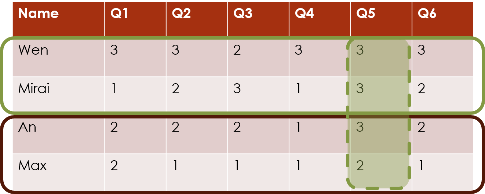
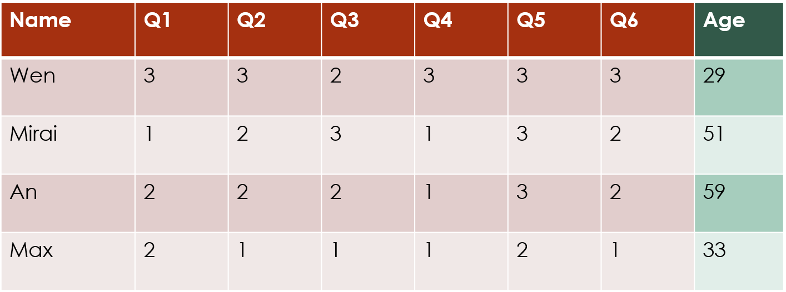
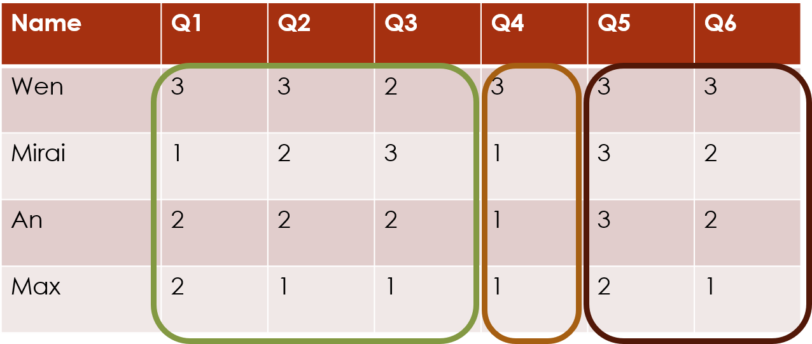

```{r setup, include=FALSE}
knitr::opts_chunk$set(echo = FALSE)
```
```{r,message=FALSE,warning=FALSE}
require(knitr)
require(formatR)
# Set so that long lines in R will be wrapped:
opts_chunk$set(tidy.opts=list(width.cutoff=40),tidy=TRUE)
```

For this package, we assume that you have a dataset of ordinal data. The most common form of this is survey data, such as you might get by asking participants to ask a series of questions with Likert-scale answers (for example, ranking from 1 = "Strongly Disagree" to 5 = "Strongly Agree"). 

```{r, out.width="70%", fig.align="center"}
knitr::include_graphics('vignette_fig/survey_table1.png')
```

There are three broad types of clustering: row clustering, column clustering and biclustering. Within each of these, there are multiple possible clustering structures. 

Mathematically, row and column clustering are equivalent, so you can orient your data matrix either way round, and just choose the appropriate clustering direction.

## Row clustering

The `clustord` package can cluster the **rows** of this data matrix, which often correspond to the subjects or the observations.

### Row clustering only

If there are no additional patterns or data we want to incorporate, then this is the simplest form of row clustering.

```{r, out.width="70%", fig.align="center"}
knitr::include_graphics('vignette_fig/survey_table2_rowclustering.png')
```

The formula will be:

`Y ~ ROWCLUST`

Parameters: `rowc`

### Row clustering with individual column effects

If you think each individual column (e.g. survey question) has slightly different patterns, then we can incorporate those into the clustering structure.

```{r, echo=FALSE, out.width="70%", fig.align="center"}

```

The formula without interaction:

`Y ~ ROWCLUST + COL`

or the formula with interaction:

`Y ~ ROWCLUST*COL`


If you have, for example, a gradient in the effects of the individual columns, then interaction between that and the row cluster would allow one cluster to have the gradient going in one direction and the other cluster to have the gradient going in the other direction.

Parameters: `rowc`, `col` and possible interaction `rowc_col`.

### Row clustering with row covariates

If you have additional information about the rows, such as demographic information about each survey respondent, that you think will influence how they answered the survey, then you can incorporate that into the clustering structure:

```{r, echo=FALSE, out.width="70%", fig.align="center"}

```

There are many possible formulae for this, but they all follow a similar style to formulae in `lm` or `glm`. 

Example formulae without interaction between row clustering and row covariates:

`Y ~ ROWCLUST + age`

`Y ~ ROWCLUST + age + nationality*occupation`


Example formulae with interaction between row clustering and some of the row covariates:

`Y ~ ROWCLUST*age + nationality*occupation`


You need to also supply these row covariates as `xr.df` to the function `mat2df()` when creating the long data frame for clustering (see the `clustord` Tutorial vignette for more details).

You can also include individual column effects as well as covariates:

`Y ~ ROWCLUST*age + COL`


Parameters: `rowc`, `cov` and possible interaction `rowc_cov`, and possible column effects `col`.

### Row clustering with column covariates

If you have additional information about the columns, such as the probability that a particular question will not be answered honestly, that you think will influence the response data, then you can incorporate that into the clustering structure:

```{r, echo=FALSE, out.width="70%", fig.align="center"}

```

The formula works the same as for other covariates:

`Y + ROWCLUST + honesty`


but you need to supply these column covariates as `xc.df` to the function `mat2df()` when creating the long form data frame.


## Column clustering

The `clustord` package can cluster the **columns** of this data matrix, which often correspond to the survey questions.

### Column clustering only

If there are no additional patterns or data we want to incorporate, then this is the simplest form of column clustering.

```{r, out.width="70%", fig.align="center"}

```

The formula will be 

`Y ~ COLCLUST`


Parameters: `colc`

### Column clustering with individual row effects

If you think each individual row (e.g. survey respondent) has slightly different patterns, then we can incorporate those into the clustering structure.

```{r, echo=FALSE, out.width="70%", fig.align="center"}
knitr::include_graphics('vignette_fig/survey_table3b_columnclustering_rows.png')
```

The formula without interaction:

`Y ~ COLCLUST + ROW`

or the formula with interaction:

`Y ~ COLCLUST*ROW`


If you have, for example, a gradient in the effects of the individual respondents, then interaction between that and the column cluster would allow one cluster of columns to have the gradient of respondents going in one direction and the other column cluster to have the gradient of respondents going in the other direction.

**IMPORTANT:** Many datasets have far more rows than columns. If this is the case, e.g. if the number of rows is > 100, then this model may not be suitable to be fitted because it requires one parameter for every row and it is difficult to fit that many parameters accurately.

Parameters: `colc`, `row` and possible interaction `colc_row`.
 
### Column clustering with column covariates

If you have additional information about the columns, such as the probability that a particular question will not be answered honestly, that you think will influence the response data, then you can incorporate that into the clustering structure:

```{r, echo=FALSE, out.width="70%", fig.align="center"}

```

The formula works the same as for other covariates. Column clustering with covariates without interaction:

`Y + COLCLUST + honesty`

Column clustering with covariates and interaction:

`Y + COLCLUST*honesty`


Supply column covariates as `xc.df` to `mat2df()`.

Parameters: `colc`, `cov` and possible interaction `colc_cov`.
 
### Column clustering with row covariates

As before, if there is additional information about the rows (e.g. survey respondents) that you think will affect the response values, you can incorporate that when clustering the columns:

```{r, echo=FALSE, out.width="70%", fig.align="center"}

```

The formula works the same as for other covariates. Column clustering with row covariates without interaction:

`Y + COLCLUST + age`

Column clustering with covariates and interaction:

`Y + COLCLUST*age`


Supply row covariates as `xr.df` to `mat2df()`.

Parameters: `colc`, `cov` and possible interaction `colc_cov`.
 
## Biclustering

The package can also cluster **both** rows and columns **simultaneously**, which we call **biclustering**. This finds the combinations of subjects and questions that exhibit similar response patterns:

```{r, out.width="70%", fig.align="center"}
knitr::include_graphics('vignette_fig/survey_table4_biclustering.png')
```

The model can include just the main row and column clustering effects:

`Y ~ ROWCLUST + COLCLUST`


or it can also include the interaction between them:

`Y ~ ROWCLUST*COLCLUST`


Parameters: `rowc`, `colc` and possible interaction `rowc_colc`.

### Biclustering with covariates

You can include covariates when performing biclustering:

```{r, echo=FALSE, out.width="70%", fig.align="center"}

```

Biclustering with row and column covariates without any interaction:

`Y + ROWCLUST + COLCLUST + age + honesty`


Biclustering with row and column cluster interactions but no covariate interaction:

`Y + ROWCLUST*COLCLUST + age + honesty`


Biclustering without interaction between row and column clusters, but with interaction between row clusters and row covariates:

`Y ~ ROWCLUST*age + COLCLUST + honesty`

Biclustering with row and column cluster interactions and interaction between row clusters and row covariates:

`Y ~ ROWCLUST*age + COLCLUST + ROWCLUST:COLCLUST + honesty`


Biclustering without interaction between row and column clusters, but with interaction between column clusters and column covariates:

`Y ~ ROWCLUST + age + COLCLUST*honesty`

Biclustering with row and column cluster interactions and interaction between column clusters and column covariates:

`Y ~ ROWCLUST + COLCLUST*honesty + ROWCLUST:COLCLUST + age`


You **cannot** include three-way interactions with the row and column cluster interaction: formula terms such as `ROWCLUST:COLCLUST:age` are disallowed.

Parameters: `rowc` and `colc`, covariate effects `cov`, possible cluster interaction `rowc_colc`, and possible cluster-covariate interactions `rowc_cov` or `colc_cov`.

\newpage

\begin{landscape}

\begin{table}
\thispagestyle{empty}
\caption{A selection of possible \texttt{clustord} models. Additional models can be constructed in similar ways.}
\tabcolsep=0.11cm
\begin{tabular}{ll|cccc|cccccccccc}
\hline
\textbf{Type} & \textbf{Formula} & \textbf{Indiv.} & \textbf{Indiv.} & \textbf{Row} & \textbf{Column} & &  &  &  &  &  &  &  &  &  \\
 &  & \textbf{column} & \textbf{row} & \textbf{covars} & \textbf{covars} &  \textbf{rowc} & \textbf{col} & \textbf{rowc\_col} & \textbf{colc} & \textbf{row} & \textbf{colc\_row} & \textbf{rowc\_colc} & \textbf{cov} & \textbf{rowc\_cov} & \textbf{colc\_cov} \\
 &  & \textbf{effects} & \textbf{effects} &  & & &  &  &  &  &  &  &  &  &  \\
 \hline
\multirow{11}{*}{Row} & {\footnotesize Y $\sim$ROWCLUST} &  &  &  &  & \checkmark &  &  &  &  &  &  &  &  &  \\
 & {\footnotesize Y $\sim$ROWCLUST + COL} & \checkmark &  &  &  & \checkmark & \checkmark &  &  &  &  &  &  &  &  \\
 & {\footnotesize Y $\sim$ROWCLUST*COL} & \checkmark &  &  &  & \checkmark & \checkmark & \checkmark &  &  &  &  &  &  &  \\
 & {\footnotesize Y $\sim$ROWCLUST + x1} &  &  & \checkmark &  & \checkmark &  &  &  &  &  &  & \checkmark &  &  \\
 & {\footnotesize Y $\sim$ROWCLUST*x1} &  &  & \checkmark &  & \checkmark &  &  &  &  &  &  & \checkmark & \checkmark &  \\
 & {\footnotesize Y $\sim$ROWCLUST + w1} &  &  &  & \checkmark & \checkmark &  &  &  &  &  &  & \checkmark &  &  \\
 & {\footnotesize Y $\sim$ROWCLUST*w1} &  &  &  & \checkmark & \checkmark &  &  &  &  &  &  & \checkmark & \checkmark &  \\
 & {\footnotesize Y $\sim$ROWCLUST + x1 + COL} & \checkmark &  & \checkmark &  & \checkmark & \checkmark &  &  &  &  &  & \checkmark &  &  \\
 & {\footnotesize Y $\sim$ROWCLUST*x1 + COL} & \checkmark &  & \checkmark &  & \checkmark & \checkmark &  &  &  &  &  & \checkmark & \checkmark &  \\
 & {\footnotesize Y $\sim$ROWCLUST + w1 + COL} & \checkmark &  &  & \checkmark & \checkmark & \checkmark &  &  &  &  &  & \checkmark &  &  \\
 & {\footnotesize Y $\sim$ROWCLUST*w1 + COL} & \checkmark &  &  & \checkmark & \checkmark & \checkmark &  &  &  &  &  & \checkmark & \checkmark &  \\
 \hline
\multirow{11}{*}{Column} & {\footnotesize Y $\sim$COLCLUST} &  &  &  &  &  &  &  & \checkmark &  &  &  &  &  &  \\
 & {\footnotesize Y $\sim$COLCLUST + ROW} &  & \checkmark &  &  &  &  &  & \checkmark & \checkmark &  &  &  &  &  \\
 & {\footnotesize Y $\sim$COLCLUST*ROW} &  & \checkmark &  &  &  &  &  & \checkmark & \checkmark & \checkmark &  &  &  &  \\
 & {\footnotesize Y $\sim$COLCLUST + x1} &  &  & \checkmark &  &  &  &  & \checkmark &  &  &  & \checkmark &  &  \\
 & {\footnotesize Y $\sim$COLCLUST*x1} &  &  & \checkmark &  &  &  &  & \checkmark &  &  &  & \checkmark &  & \checkmark \\
 & {\footnotesize Y $\sim$COLCLUST + w1} &  &  &  & \checkmark &  &  &  & \checkmark &  &  &  & \checkmark &  &  \\
 & {\footnotesize Y $\sim$COLCLUST*w1} &  &  &  & \checkmark &  &  &  & \checkmark &  &  &  & \checkmark &  & \checkmark \\
 & {\footnotesize Y $\sim$COLCLUST+ x1 + ROW} &  & \checkmark & \checkmark &  &  &  &  & \checkmark & \checkmark &  &  & \checkmark &  &  \\
 & {\footnotesize Y $\sim$COLCLUST*x1 + ROW} &  & \checkmark & \checkmark &  &  &  &  & \checkmark & \checkmark &  &  & \checkmark &  & \checkmark \\
 & {\footnotesize Y $\sim$COLCLUST + w1 + ROW} &  & \checkmark &  & \checkmark &  &  &  & \checkmark & \checkmark &  &  & \checkmark &  &  \\
 & {\footnotesize Y $\sim$COLCLUST*w1 + ROW} &  & \checkmark &  & \checkmark &  &  &  & \checkmark & \checkmark &  &  & \checkmark &  & \checkmark \\
 \hline
\multirow{6}{*}{Biclustering} & {\footnotesize Y $\sim$ROWCLUST + COLCLUST} &  &  &  &  & \checkmark &  &  & \checkmark &  &  & \checkmark &  &  &  \\
 & {\footnotesize Y $\sim$ROWCLUST*COLCLUST} &  &  &  &  & \checkmark &  &  & \checkmark &  &  & \checkmark &  &  &  \\
 & {\footnotesize Y $\sim$ROWCLUST + COLCLUST + x1} &  &  & \checkmark &  & \checkmark &  &  & \checkmark &  &  & \checkmark & \checkmark &  &  \\
 & {\footnotesize Y $\sim$ROWCLUST*COLCLUST + x1} &  &  & \checkmark &  & \checkmark &  &  & \checkmark &  &  & \checkmark & \checkmark &  &  \\
 & {\footnotesize Y $\sim$ROWCLUST + COLCLUST + w1} &  &  &  & \checkmark & \checkmark &  &  & \checkmark &  &  & \checkmark & \checkmark &  &  \\
 & {\footnotesize Y $\sim$ROWCLUST*COLCLUST + w1} &  &  &  & \checkmark & \checkmark &  &  & \checkmark &  &  & \checkmark & \checkmark &  & \\
 \hline
\end{tabular}
\end{table}

\end{landscape}