<!-- # ```{r , include=FALSE} -->
<!-- # knitr::opts_chunk$set(eval=FALSE) -->
<!-- # ``` -->
```{r,echo=FALSE,message=FALSE,warning=FALSE}
require(knitr)
require(formatR)
# Set so that long lines in R will be wrapped:
opts_chunk$set(tidy.opts=list(width.cutoff=40),tidy=TRUE)
```

# **TL:DR**

The `clustord()` function can perform row clustering, column clustering or biclustering of a data matrix. The `formula` argument works similarly to the ones in `lm()` and `glm()`, except it uses four special keywords: `ROWCLUST` and `COLCLUST` include row or column clusters, and `ROW` and `COL` include individual row and column effects.

You have to convert the data matrix to long-format **before clustering**, using the `mat2df()` function. **After clustering**, perform model selection using AIC or BIC in the `criteria` part of the output. Examine the **parameter estimates** within the `parlist.out` part of the output. **Positive** parameter estimates increase the chances of getting **higher** ordinal responses, whereas **negative** parameter estimates increase the chances of getting **lower** ordinal responses.

You can include covariates in the clustering, and they can be numerical or categorical, just like predictors in a regression model. Add these as inputs to `mat2df()` to make the object for clustering. Use the covariate names in the formula like in `lm()` or `glm()`.

Check the algorithm has converged using `EM.status$converged` in the output object, and if it has not, try increasing the number of random starting points using `nstarts` or increase the number of EM iterations using the `EM.control = list(EMcycles = X)` input, where X is the number of iterations you want.

`clustord` can fit two kinds of ordinal models. "POM", the proportional-odds model, is the simplest, and the most widely used ordinal model. "OSM", the ordered stereotype model, is more flexible and its `phi` parameters can be used as a more informed way of recoding the ordinal data numerically. These two models are discussed in a **separate vignette**, *"Ordinal Models"*.

# Introduction

The package **`clustord`** uses a function `clustord()` to link **finite-mixture clustering and biclustering** (Pledger and Arnold, 2014) with two ordinal models: the proportional odds model and the ordered stereotype model (Agresti, 2010, and Anderson, 1984). The clustering models in this package are highly flexible and can incorporate distinct patterns of subsets of items within clusters, and can also incorporate additional covariates.

For this package, we assume that you have a dataset of ordinal data. The most common form of this is survey data, such as you might get by asking participants to ask a series of questions with Likert-scale answers (for example, ranking from 1 = "Strongly Disagree" to 5 = "Strongly Agree"). 

```{r, echo=FALSE, out.width="70%", fig.align="center"}
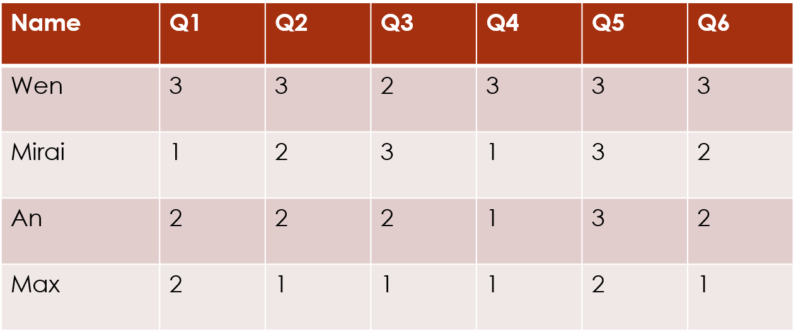
```

The `clustord` package can cluster the **rows** of this data matrix, which often correspond to the subjects or the observations:

```{r, echo=FALSE, out.width="70%", fig.align="center"}
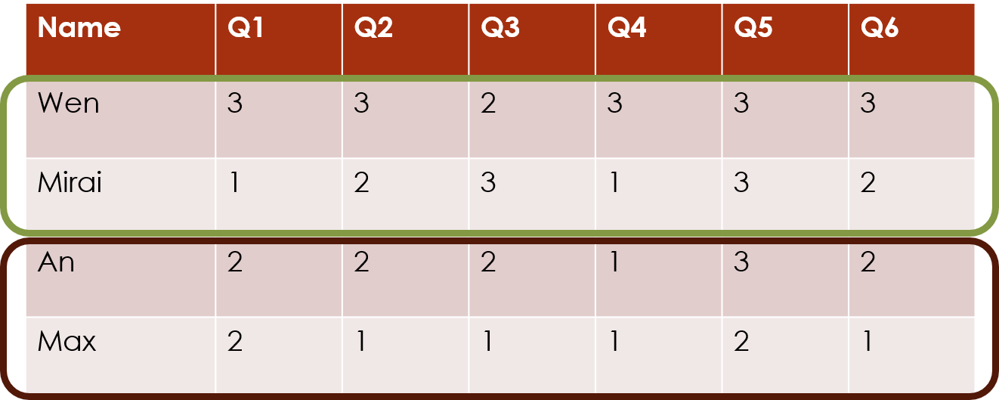
```

Or the package can cluster the **columns** of this data matrix, which often correspond to the survey questions:

```{r, echo=FALSE, out.width="70%", fig.align="center"}
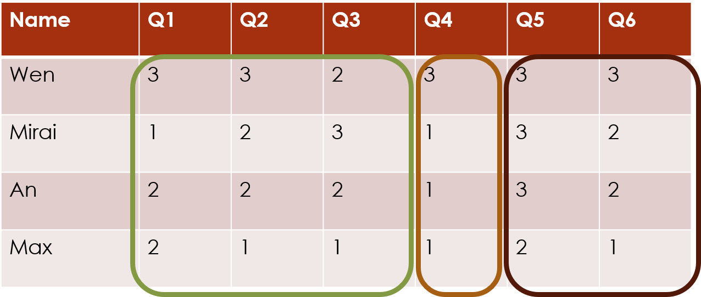
```

Mathematically, these two forms of clustering are equivalent, so you can orient your data matrix either way round, and just choose the appropriate clustering direction. 

The package can also cluster **both** rows and columns **simultaneously**, which we call **biclustering**. This finds the combinations of subjects and questions that exhibit similar response patterns:

```{r, echo=FALSE, out.width="70%", fig.align="center"}
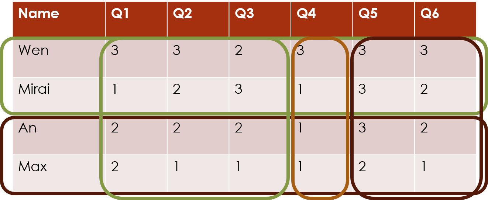
```


## Model-based clustering

The clustering algorithms in this package are **model-based clustering** methods. The models are finite-mixture models, in which each cluster is assumed to correspond to a particular statistical distribution.

```{r, echo=FALSE, out.width="70%", fig.align="center"}
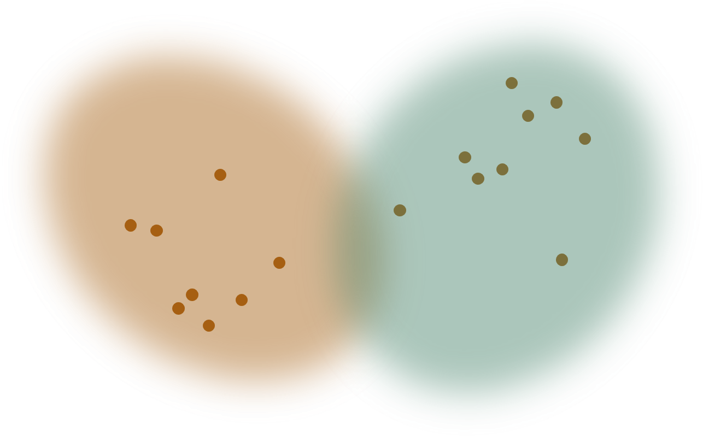
```

Many common clustering methods, such as k-means (Lloyd, 1982 and MacQueen, 1967) are **distance-based** instead of model-based.

```{r, echo=FALSE, out.width="70%", fig.align="center"}
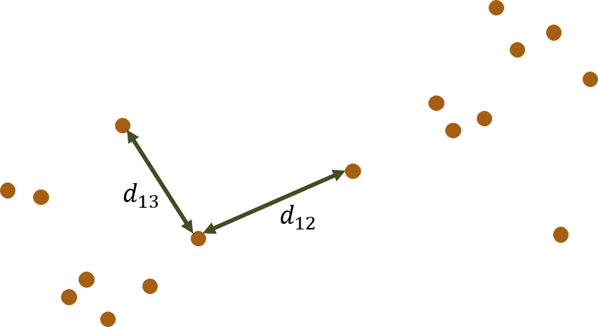
```

Model-based clustering methods often take a little longer to set up and run, but they have one major advantage. All clustering methods estimate which cluster each item is a member of. This package, like other finite-mixture methods, provides **posterior probabilities of cluster membership**, given the data. But because the clusters are assumed to correspond to statistical distributions, these methods also provide **parameter estimates** for the statistical distributions. In other words, you can obtain general information about the patterns exhibited by the clusters. 

The statistical framework of model-based clustering also allows you to carry out goodness-of-fit tests and perform model selection using common measures such as AIC and BIC.

This package fits the mixture models by maximising the likelihood using the Expectation-Maximisation algorithm (Dempster, Laird & Rubin 1977, McLachlan and Krishnan 2007). Many examples of these types of models can be found in, e.g., McLachlan & Basford (1988) or McLachlan & Peel (2000).

## Ordinal data

```{r, echo=FALSE, out.width="70%", fig.align="center"}
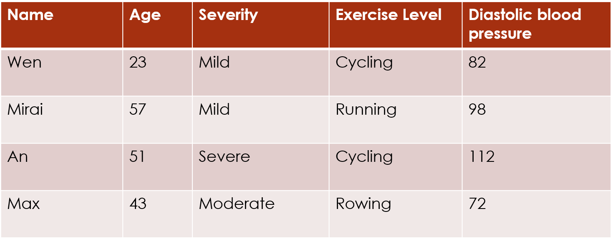
```

A very common approach to clustering ordinal data is to number the categories of each ordinal variable and then treat the data as continuous. This allows the use of numerical clustering methods like k-means. But the encoding of the ordinal categories as continuous encodes assumptions about the relative spacings of the ordinal categories.

The most common approach is to number the categories from 1 to $q$:

```{r, echo=FALSE, out.width="70%", fig.align="center"}
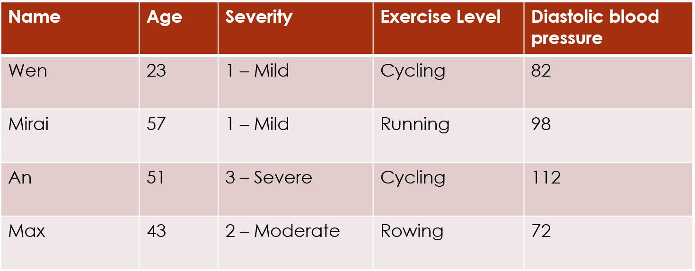
```

and then often the category labels are dropped:

```{r, echo=FALSE, out.width="70%", fig.align="center"}
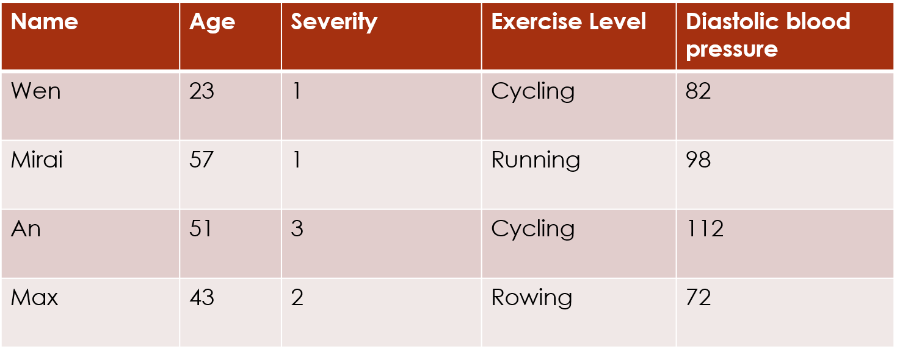
```

This encoding assumes that the levels 1 and 2 are as close together as levels 2 and 3. But that assumption is not necessarily accurate. For example, if people are asked a question about how much pain they are feeling, there may be a bigger difference in perception between pain levels Moderate and Severe (2 and 3) than between pain levels Mild and Moderate (1 and 2):

```{r, echo=FALSE, out.width="70%", fig.align="center"}
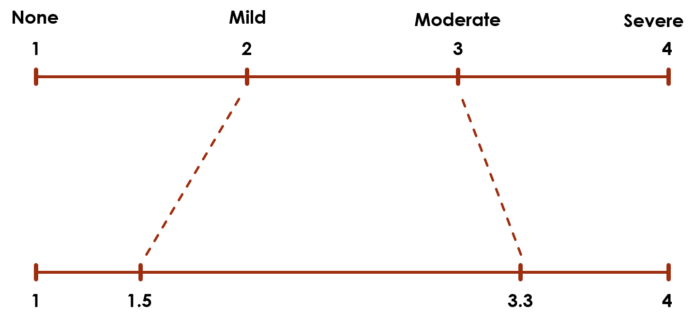
```

The top scale assumes the levels are equally spaced, but the bottom scale could be a more accurate representation.

Rather than treating the ordinal data as numerical and applying continuous-data clustering algorithms, the ordinal models in this package make no assumptions about the numerical encoding of the ordinal categories, and only observe the ranking of the categories.

The **ordered stereotype model (OSM)**, one of the two ordinal models in this package goes further: a set of the model parameters, $\{phi_k\}$, can be treated as scores for the category levels. The fitted values of the parameters can be used as a scoring system that more accurately reflects the spacings between the levels according to the data:

```{r, echo=FALSE, out.width="70%", fig.align="center"}
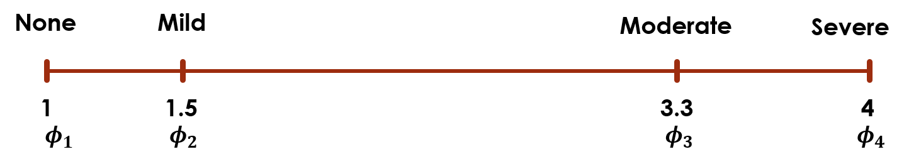
```

If you start with five categories, but the fitted $\{\phi_k\}$ values for levels 1 and 2 are very close together (e.g. 0 and 0.09), this indicates that there is almost no different in the information provided by levels 2 and 3. So you could potentially combine those two levels, and simplify the data without losing much information.

The ordinal models are discussed in more detail in the *Ordinal Models* vignette.

# Fitting `clustord` models

```{r, message=FALSE, warning=FALSE}
library(clustord)
```

## Data format

For this vignette, we will use a simple survey example, in which the data matrix is a matrix of responses to questions with the subjects as rows and the questions as columns. All the questions have responses between 1 and 7 -- the current version of `clustord` is not set up to handle datasets where some questions have more responses than others.

```{r}
df <- read.table("eval_survey.txt")
colnames(df) <- paste0("Q",1:ncol(df))
rownames(df) <- paste0("ID",1:nrow(df))
head(df)
dim(df)
```

The illustrations show a tiny exemplar dataset. The actual dataset in this analysis has 82 rows (subjects) and 12 columns (questions).

We will refer to the data matrix as $\bm{{Y}}$. We index the rows of the data matrix  with $i$ and the columns of the data matrix with $j$, so an individual response value is defined as $Y_{ij}$.

```{r, echo=FALSE, out.width="70%", fig.align="center"}
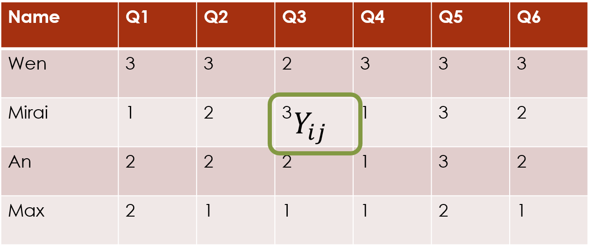
```

Before we can carry out any model-fitting with `clustord`, we need to convert the data into a long-form data frame instead of a data matrix. This long form, which is used to simplify the inner implementation of the clustering process, has one row per cell in the original data frame. Two of its columns are labelled `ROW` and `COL` and these indicate which row and column in the original data frame the response value came from:

```{r, echo=FALSE, out.width="40%", fig.align="center"}
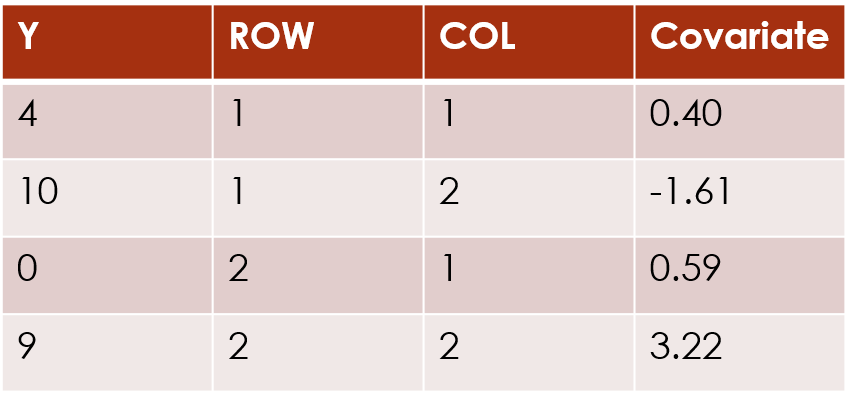
```

If a cell in the data matrix has missing data, that entry is not included in the long-form data frame (so if 1 cell in a 10x10 data matrix is missing, the long-form data frame will have 99 rows).

The long-form also incorporates any covariates linked to the responses. We will discuss these more later.

`clustord` provides a function, `mat2df()`, to carry out the conversion to the long form data frame:

```{r}
long.df <- mat2df(df)
head(long.df)
```

You may construct the long-form data frame yourself if you want, but there are minor restrictions: the data frame **MUST contain** a column labelled "Y" that contains the response values, a column labelled "ROW" (case-sensitive) that contains the row names/numbers and a column labelled "COL" (case-sensitive) that contains the column names/numbers, and rows for missing cell values (`NA` or any other missing indicators) should be deleted.

## `clustord` models

The specific structure of clustering model used in this page is the form proposed in Pledger and Arnold (2014). That paper proposed models for binary and count data (see the `clustglm` package by Shirley Pledger), and similar forms were proposed for the proportional odds model in Matechou et al. (2016) and for the ordered stereotype model in Fernández et al. (2016, 2019). 

These clustering models all have a linear predictor structure. The link between the linear predictor and the response values varies for the two different ordinal models, but the linear predictor structure is the same for both, and the same linear predictor structure is used in the `clustglm` models.

We will define $\nu_{ij}$ to be the linear predictor for response $Y_{ij}$. 

The various models outlined below include different additive components in the linear predictor that will influence the probabilities of obtaining different response categories. We will call these components "effects". Regression models are often described as including "main effects" and "interaction effects", and sometimes "random effects", and similarly our clustering models will primarily have "cluster effects". But we can also include "covariate effects" and "individual row/column effects".

## Row clustering 

### Row cluster effect only

We will describe possible row clustering structures first. The individual row clusters are indexed $r$. The most basic row clustering model only has row cluster effects, and it assumes that every response across all columns for a row $i$ in cluster $r$ has the same probabilities for different categories. 

The main part of the linear predictor for this model is the "row cluster effect", that differs from cluster to cluster. The row cluster effect parameters are labelled as `rowc` in the `clustord()` output.

```{r, echo=FALSE, out.width="70%", fig.align="center"}

```

In the console output, this basic model is described as the `row-cluster-only model`. By default, this model is used as the starting point for the other models: the starting points for the row cluster parameter estimates are found by fitting this simpler model first before fitting the full forms of more complex models.

#### Fitting the model

We can fit this model using the `clustord()` function, which is the main model-fitting function in `clustord`. The first input argument for `clustord()` is `formula`, which gives the formula for the model, just as in `lm()`, `glm()` and other similar functions.

We fit this model using the **case-sensitive keyword** `ROWCLUST` in the formula. The left-hand side of the formula **is always `Y`**. So the basic formula is:
```
Y ~ ROWCLUST
```

The next input argument is a character string indicating the `model`, which is either `"POM"` for the proportional-odds model, `"OSM"` for the ordered-stereotype model, or `"Binary"` for the binary model (which is the same for proportional-odds and ordered-stereotype). We'll talk about these models in more detail later, and for now we'll use the proportional-odds model, which is the most widely-used and simplest ordinal model.

The third and fourth input arguments are `nclus.row` and `nclus.column`, which are used to define the number of row and/or column clusters. While we are doing row clustering, we will only specify `nclus.row` and we will choose to fit 2 clusters. `clustord` can only fit a specified number of clusters, and later we will discuss how to select the best number of clusters.

The fifth input argument is `long.df`, which is asking for the long form data frame we prepared earlier. So, leaving all the rest of the arguments at their default values, we fit the basic row clustering model to our dataset:

```{r ROWFIT, eval=FALSE}
set.seed(2)
fit_rowclust_only <- clustord(Y ~ ROWCLUST, "POM", nclus.row=2, 
                              long.df=long.df, verbose=FALSE)
```
```{r, echo=FALSE}
load("tutorial_fits.Rdata")
```

This also uses the option `verbose=FALSE` which displays reduced output during the progress of the algorithm. We will discuss the meaning of the outputs in the section on important algorithm settings.

This tutorial set the random number seed before running the fitting process, in order to keep the included output consistent. The algorithm uses a random selection of starting points (see the section on important algorithm settings for more detail).

#### Checking the output

Once the fit is completed we should first check that it has converged:

```{r}
fit_rowclust_only$EM.status$converged
```

Then we can look at the probabilities of cluster membership:

```{r}
round(fit_rowclust_only$ppr,2)
```

In this instance, almost all of the individuals have been firmly assigned to one cluster or the other cluster. I can also look at the cluster memberships, which are obtained by the simple assignment process of assigning each individual to the cluster for which they have the highest posterior probability of membership (there are other ways to assign individuals to clusters, but those are not implemented within `clustord`).  

```{r}
fit_rowclust_only$RowClusterMembers
```

For each cluster, a vector of row numbers in that cluster is provided. In this instance, only four individuals have been allocated to the second cluster.

The "mixing proportions", $\pi_r$, summarise the proportion of rows in each cluster (each mixing proportion is the mean of the posterior probabilities for membership of that cluster across all the rows). 

```{r}
round(fit_rowclust_only$pi.out, 2)
```

So only about 5\% of the rows are in the second cluster, which matches what we saw from the cluster memberships.

We can look at the parameter values for each cluster. The `mu` values in the parameter list will be discussed later, in the section about the different ordinal models. For now, we will just look at the row cluster effects, which are called `rowc`. The output includes the `.init` parameter values that were used at the start of the EM algorithm, and the `.out` parameter values that are the final ones at the end of the algorithm, so the `.out` values are the ones we want:

```{r}
fit_rowclust_only$parlist.out$rowc
```

**Positive** values of the row cluster parameters increase the probability of getting **higher** ordinal categories, and **negative** values of the parameters increase the probability of getting **lower** ordinal categories.

We can see from this that individuals in the first cluster tend to provide higher-value responses than individuals in the second cluster.

We can also check this against the mean value of responses for individuals in the first and second clusters:

```{r}
boxplot(split(rowMeans(df), fit_rowclust_only$RowClusters), 
        "Mean response values across all questions for each individual", 
        names = c("Cluster 1", "Cluster 2"))
```

We will discuss goodness-of-fit later in the section about model selection.

### Row clusters with individual column effects

A second, slightly more complex row clustering model is one that incorporates both the row cluster effects and also individual effects of the columns. 

```{r, echo=FALSE, out.width="70%", fig.align="center"}
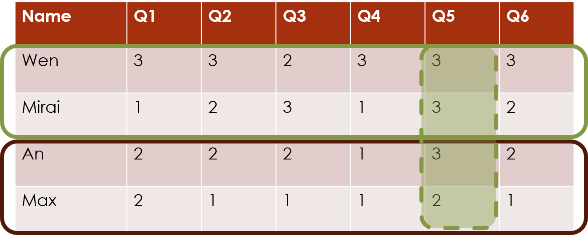
```

We can see by looking at the actual data that this is necessary, because we can see that the responses to Q1 tend to have much higher values than the responses for the other questions. The row-cluster-only model above treats all the columns as repeated measures, but that does not appear to be a reasonable assumption in this case. 

```{r}
head(df)
```

The additive nature of the clustering models in this package allows to add to the linear predictor an effect of the individual columns. The main part of the linear predictor for this model becomes `rowc + col` where `col` are the individual effects of the columns. 

#### Fitting the model

We fit this model using the **case-sensitive keyword** `COL` in the formula:
```
Y ~ ROWCLUST + COL
```

As you can see, the formula, just like the linear predictor, builds up the components additively, just as in a regression formula argument.

Note that, by default, when we try to fit this more complex model, `clustord()` will generate starting values for the row cluster effect parameters by fitting the row-cluster-only model first, before fitting the model with column effects.

We will fit this model using the same model type as before, POM:

```{r ROWCOLFIT, eval=FALSE}
set.seed(3)
fit_rowclust_cols <- clustord(Y ~ ROWCLUST + COL, "POM", 
                              nclus.row=2, long.df=long.df, verbose=FALSE)
```


#### Checking the output

Again, once the fit is completed we should first check that it has converged:

```{r}
fit_rowclust_cols$EM.status$converged
```

Then we can look at the probabilities of cluster membership:


```{r}
round(fit_rowclust_cols$ppr, 2)
```

In this case, we can see that some of the individuals have been less firmly assigned to one particular cluster than was the case for the row-cluster-only model.

If we assign to clusters based on highest probability, let's see the lists of cluster members:

```{r}
fit_rowclust_cols$RowClusterMembers
```

We see that once we allow for some of the columns to be different than others, we end up with a more evenly split pair of clusters.

Now let's look at the parameter values for each cluster:

```{r}
fit_rowclust_cols$parlist.out$rowc
```

In this fit, the first cluster has a negative row cluster effect, i.e. the individuals will tend to provide lower category responses, and the second cluster has a positive row cluster effect, i.e. the individuals will tend to provide higher category responses.

Note that the "order" of the clusters appears to be different for this fit than the previous one: the row-cluster-only fit had the positive cluster effect for the first cluster and the row-clusters-with-columns fit had the negative cluster effect for the first cluster. This is very common, and is a clustering phenomenon known as "label-switching". The mathematical model for the cluster is equivalent whichever order the clusters are in, so the clustering algorithm can't tell the difference between different orderings of the clusters. So for now, just know that we should not read anything into the fact that the order has changed.

Again, let's check the mean value of responses for individuals in the first and second clusters:

```{r}
boxplot(split(rowMeans(df), fit_rowclust_cols$RowClusters), "Mean response values across all questions for each individual", names = c("Cluster 1", "Cluster 2"))
```

You can see that although the order of the clusters is different than before, there is still a clear differentiation between the typical responses in Cluster 1 vs. Cluster 2. 

Now let's also check the column effect parameters:

```{r}
round(fit_rowclust_cols$parlist.out$col, 2)
```

You can see that the first column parameter, for Q1, is much higher than the others, which matches what we observed in the data, i.e. the much higher response values for that column than the others.

Q4 has the lowest value parameter, so that question tends to get lower value responses than the others, but the effect is not as dramatic as for Q1.

Most of the parameter values for the column effects are small to medium, but even just the presence of one or two very different columns is a good reason to fit this model with column effects.

### Row clusters with individual column effects and interactions

A third row clustering structure allows us to include not only column effects, but also the interactions of those column effects with the rows.

What this means is that in some datasets, the individuals may exhibit a particular pattern of responses across the questions that varies between clusters. For example, cluster 1 individuals might tend to answer the initial questions with high-value responses and the later questions with low-value responses, whereas cluster 2 individuals might tend to answer the initial questions with low-value responses and the later questions with high-value responses. That would be an interaction pattern.

For this model, the linear predictor adds an additional component, `rowc_col`, which is a matrix of parameters that show the interaction effects between each cluster and each column.

**IMPORTANT WARNING:** Depending on the number of columns you have in your dataset, but especially if you have more than 10, then adding the interaction term adds quite a lot of additional parameters to the model. The total number of non-dependent parameters will be: $R-1$ (for the mixing proportion parameters that indicate the proportion of rows in each cluster) + $R-1$ (for the row cluster effects) + $m$ (for the number of columns, $m$) + $(R-1)\times(m-1)$ (for the row-cluster and column interactions) + $q-1$ (for the category parameters $\{\mu_k\}$, described in the ordinal models section). $q$ is the number of categories/levels in each response variable. The total number of parameters is approximately equal to $mR$.

Therefore it may not be a good idea to fit this model if $n < 20m$. This is not a rigorously tested limit, but a very rough rule of thumb; at the very least, if fitting this model you should carry out model selection but also carefully decide on the number of iterations and check for convergence. 

In this case, our dataset is **too small**, but we will fit the model to illustrate the process.

The interaction model will also take longer to fit than the previous two models, because the larger number of parameters can lead to longer convergence times.

By default, the algorithm fits the row-cluster-only model and the model without interactions (called the "intermediate rowcluster-column model" in the output) first in order to find good starting values for the parameters in the interaction model. This often saves time by reducing the number of iterations of the full model.

#### Fitting the model

The formula for interactions works the same as in regression models in R, with its two options for adding interactions. These two formulae are equivalent:
```{r}
Y ~ ROWCLUST + COL + ROWCLUST:COL
Y ~ ROWCLUST * COL
```

```{r ROWCOLINTERACT, eval=FALSE}
set.seed(1)
fit_rowclust_cols_interact <- clustord(Y ~ ROWCLUST * COL, "POM", 
                                       nclus.row=2, long.df=long.df, verbose=FALSE)
```
#### Checking the output

Again, once the fit is completed we should first check that it has converged:

```{r}
fit_rowclust_cols_interact$EM.status$converged
```

Then we can look at the probabilities of cluster membership:

```{r}
round(fit_rowclust_cols_interact$ppr, 2)
```

Let's see the lists of cluster members:

```{r}
fit_rowclust_cols_interact$RowClusterMembers
```
Now let's look at the parameter values for each cluster:

```{r}
fit_rowclust_cols_interact$parlist.out$rowc
```

And again, we can show that the first cluster has higher response values than the second cluster, although now there appears to be more overlap:

```{r}
boxplot(split(rowMeans(df), fit_rowclust_cols_interact$RowClusters), "Mean response values across all questions for each individual", names = c("Cluster 1", "Cluster 2"))
```

Now let's check the column effect parameters:

```{r}
round(fit_rowclust_cols_interact$parlist.out$col, 2)
```

When we include the interaction terms, the column effects have become a bit larger than before for some columns.

We can then finally check the interaction effects:

```{r}
round(fit_rowclust_cols_interact$parlist.out$rowc_col, 2)
```

We can plot these interaction terms against each other to see the interaction effects:

```{r}
rowc_col <- fit_rowclust_cols_interact$parlist.out$rowc_col
plot(rowc_col[1,], type="b", col="black", lwd=2, ylim=c(-1.3,1.3))
lines(rowc_col[2,], lty=2, col="blue", lwd=2)
points(rowc_col[2,], lty=2, col="blue", lwd=2)
legend("bottomright", legend=c("Cluster 1","Cluster 2"), col=c("black","blue"),
       lwd=c(2,2), lty=1:2)
```

This suggests that individuals in cluster 1 tend to give low-value responses to questions 1 and 6, and high-value responses for the rest, and the reverse for individuals in cluster 2 (the large cluster). 

### Model selection

If you have fitted multiple models, then you will need to select the best one. The advantage of model-based clustering methods is that you can use information criteria and/or the likelihoods of the models to select the best one.

Sticking with only two clusters, let's see which is the best out of the three models above. `clustord()` provides the set of information criteria listed below, of which the most widely used are AIC (Akaike, 1973) and BIC (Schwarz, 1978), so let's use those for now. 

\begin{table}
\centering
\caption{Information criteria definitions} 
	\begin{tabular}{ll}
        \\
		\hline
        \\
	\bfseries{Information Criterion}& \bfseries{Formula}\\
    \hline
    \\
	Residual Deviance     &  $-2\ell$        \\
	AIC (Akaike, 1973)       &  $-2\ell+2\nu$      \\
	AICc (Akaike, 1973)    &  $\mathrm{AIC}+\frac{2\nu(\nu+1)}{nm-\nu-1}$    \\
	BIC (Schwarz, 1978)      &  $-2\ell+\nu\left[\log(nm)\right]$  \\             
	ICL-BIC (Biernacki et al., 2000) &  $-2\ell_c+\nu \log(nm)$ \\
    \\
	\hline 
	\end{tabular}
\end{table}

\begin{itemize}
\item $n$ is the number of rows in the data matrix
\item $m$ is the number of columns in the data matrix
\item $\ell$ is the maximised incomplete-data log-likelihood
\item $\ell_c$ is the maximized complete-data log-likelihood
\item $\nu$ is the total number of non-redundant parameters in the model
\end{itemize}

```{r}
fit_rowclust_only$criteria$AIC
fit_rowclust_cols$criteria$AIC
fit_rowclust_cols_interact$criteria$AIC

fit_rowclust_only$criteria$BIC
fit_rowclust_cols$criteria$BIC
fit_rowclust_cols_interact$criteria$BIC
```

For both AIC and BIC, lower values indicate better goodness-of-fit. So we can see that according to AIC the third model, with column effects and interactions, is best, whereas according to BIC the second model, with column effects but no interactions, is the best. This makes sense, because BIC was designed to penalize complexity more than AIC does, and the third model is the most complex one.

In this case, since the values for the second and third models are roughly comparable, and simplicity makes models easier to interpret, we would choose to stick with the second model rather than the third.

### Incomplete-data and complete-data log-likelihoods

Note that all of the information criteria provided by `clustord()` are based on either the incomplete-data or the complete-data log-likelihood. 

The meaning of "likelihood" in a statistical context is the probability of obtaining the observed data, given a particular set of parameter values. `clustord()`, like all likelihood-based model-clustering methods, attempts to find the set of parameter values with the highest likelihood, although it can only maximise the parameters for one single model at a time. In fact, it attempts to maximise the log-likelihood instead, which is more numerically accurate unless you have a really tiny dataset (< 20 rows and columns)

Any attempt to fit a mixture model requires the maximisation of the parameters of the individual clusters (here these include the `rowc`, `col` and `rowc_col` parameters described above) and the "mixing proportions" for the clusters (the $\{\pi_r\}$ parameters described above). `clustord()` uses the EM algorithm to perform model fitting, and this also treats the cluster membership probabilities as unknown quantities that need to be estimated. 

`clustord()` therefore calculates two types of likelihood. One is the **complete-data log-likelihood**, which is the log-likelihood of the parameters and mixing proportions, **given a specific set of cluster membership probabilities** (which are usually the estimated probabilities from the latest EM algorithm iteration). 

The second is the **incomplete-data log-likelihood**, which is the log-likelihood of the parameters and mixing proportions **after integrating out all possible cluster memberships**. This is what, in any other context, would be called simply "the log-likelihood" of the model. This is the core log-likelihood we need to find, and the complete-data log-likelihood is simply a stepping-stone on the way to finding it. 

The presence of these two types of likelihood or log-likelihood in the algorithm is why `clustord()` always labels every log-likelihood it calculates as either "complete-data" or "incomplete-data". 

\newpage
## Column clustering

So far we have demonstrated how to cluster the rows of the data matrix. But we can also cluster the columns of the data matrix. For our example dataset, this would correspond to clustering the questions in the survey, to find out which groups had similar patterns of responses.

We could easily do this by transposing the data matrix and then running the above row clustering models on it, since the column clustering and row clustering models are mathematically equivalent. This transposition is is what `clustord()` does. If you apply the column clustering models, then `clustord()` transposes the data, runs the row clustering algorithm, and then flips the data matrix and all the output results back to their original orientation.

Let's try this with our existing dataset. The models have the same structure as before.

### Column cluster effect only

The simplest column clustering model is the column-cluster-only model, where the main part of the linear predictor is `colc`, the column cluster effect.

We use the case-sensitive keyword `COLCLUST` in the formula, and we need to set `nclus.column` instead of `nclus.row`:

```{r COLFIT, eval=FALSE}
set.seed(1)
fit_colclust_only <- clustord(Y ~ COLCLUST, model = "POM", nclus.column = 2, 
                              long.df = long.df, verbose=FALSE)
```

In column clustering, the mixing proportions are renamed $\{\kappa_c\}$ (to avoid confusion when performing biclustering with both sets of mixing proportions, as seen below). The cluster membership probabilities are stored in the output as `ppc` not `ppr` and the cluster memberships are named `ColumnClusters` not `RowClusters` and the lists of cluster members are named `ColumnClusterMembers` not `RowClusterMembers`. 

```{r}
# Convergence
fit_colclust_only$EM.status$converged

# Column cluster membership probabilities
round(fit_colclust_only$ppc,2)

# Members of each column cluster
fit_colclust_only$ColumnClusterMembers

# Mixing proportions
round(fit_colclust_only$kappa.out,2)

# Parameters
fit_colclust_only$parlist.out$colc
```

The algorithm has converged, all of the columns are firmly allocated to one or other of the clusters, and they are roughly equally split between the two clusters. 

The parameter values indicate that cluster 1 questions tend to have higher response values than cluster 2 questions (and note that the question with the highest typical responses, Q1, is in the first cluster, as we'd expect).

### Column clusters with individual row effects

Similarly to row clustering, with column clustering we can fit a model that incorporates individual row effects, to account for the fact that some individual subjects may have different response patterns than others.

This uses the case-sensitive keyword `ROW`.

```{r COLROWFIT, eval=FALSE}
set.seed(1)
fit_colclust_rows <- clustord(Y ~ COLCLUST + ROW, model = "POM", nclus.column = 2, 
                              long.df = long.df, verbose=FALSE)
```


```{r}
# Convergence
fit_colclust_rows$EM.status$converged

# Column cluster membership probabilities
round(fit_colclust_rows$ppc,2)

# Members of each column cluster
fit_colclust_rows$ColumnClusterMembers

# Mixing proportions
round(fit_colclust_rows$kappa.out,2)

# Parameters
fit_colclust_rows$parlist.out$colc
round(fit_colclust_rows$parlist.out$row, 2)
```

We see that in this case, column clustering with individual row effects has detected that column Q1 is different to all the other columns, so that is in a cluster on its own, with a much higher probability of getting high value responses. There is almost zero uncertainty about the cluster memberships. 

A few rows have big negative parameters, and thus are much more likely to show lower-value responses. These are probably the same few that were identified during the row clustering process as having lower response values than the rest.


### Column clusters with individual row effects and interaction

And, as before, we can add interactions between the column cluster effects and the individual row effects, using the usual R interaction formula notation.

```{r COLROWINTERACT, eval=FALSE}
set.seed(1)
fit_colclust_rows_interact <- clustord(Y ~ COLCLUST * ROW, model = "POM", nclus.column = 2, 
                                       long.df = long.df, verbose=FALSE)
```

The interaction terms added are named `colc_row`.

```{r}
# Convergence
fit_colclust_rows_interact$EM.status$converged

# Column cluster membership probabilities
round(fit_colclust_rows_interact$ppc,2)

# Members of each column cluster
fit_colclust_rows_interact$ColumnClusterMembers

# Mixing proportions
round(fit_colclust_rows_interact$kappa.out,2)

# Parameters
fit_colclust_rows_interact$parlist.out$colc
round(fit_colclust_rows_interact$parlist.out$row, 2)
round(fit_colclust_rows_interact$parlist.out$colc_row, 2)
```

Adding interactions between individual rows and column clusters has not changed the cluster memberships, compared with the model without interactions, but it has made the effects of the clusters stronger, as seen in the `colc` parameters, and it has made the individual row effects much bigger.

We can plot these interaction terms against each other to see the interaction effects:

```{r}
colc_row <- fit_colclust_rows_interact$parlist.out$colc_row
plot(colc_row[1,], type="b", col="black", lwd=2, ylim=c(-85,85),
     xlab="Subject", ylab="Cluster interaction effect")
lines(colc_row[2,], lty=2, col="blue", lwd=2)
points(colc_row[2,], lty=3, col="blue", lwd=2)
legend("topleft", legend=c("Cluster 1","Cluster 2"), col=c("black","blue"),
       lwd=c(2,2), lty=c(1,3))
```


We can see that there is a huge difference between the response values for cluster 1 (Q1) and cluster 2 (the rest of the questions) for the last subject, but other than that the cluster responses are broadly similar for most subjects. Zooming in on the rest of the plot:


```{r}
colc_row <- fit_colclust_rows_interact$parlist.out$colc_row
plot(colc_row[1,], type="b", col="black", lwd=2, ylim=c(-10,10),
     xlab="Subject", ylab="Cluster interaction effect")
lines(colc_row[2,], lty=2, col="blue", lwd=2)
points(colc_row[2,], lty=3, col="blue", lwd=2)
legend("topleft", legend=c("Cluster 1","Cluster 2"), col=c("black","blue"),
       lwd=c(2,2), lty=c(1,3))
```

There is no clear pattern to this, which often suggests that the model is not well-fitted.

### Model selection

Again, we will look at AIC and BIC to perform model selection amongst the column clustering models.

```{r}
fit_colclust_only$criteria$AIC
fit_colclust_rows$criteria$AIC
fit_colclust_rows_interact$criteria$AIC

fit_colclust_only$criteria$BIC
fit_colclust_rows$criteria$BIC
fit_colclust_rows_interact$criteria$BIC
```

In this instance, AIC selects the model with individual row effects and interactions, though it has very similar AIC to the model with individual row effects and no interactions. BIC selects the model with column clusters only.

When AIC and BIC disagree about which model to select, then it is time to include external factors, such has how important simplicity is for the sake of helping end-users to understand your model. Even under AIC, the value for the column-cluster-only model is not a great deal higher than the AIC values for the other two models, so it would be justifiable to select the column-cluster-only model for simplicity and to match the BIC selection.

\newpage
## Biclustering

So far we have demonstrated how to cluster the rows or the columns of the data matrix. `clustord` can also cluster the rows and columns simultaneously. We call this **biclustering** or "two-mode clustering", though this term is not universally used (Jacques and Biernacki (2018) for example, calls it "co-clustering"). For our example dataset, this would correspond to clustering the subjects **and** the questions in the survey, to find out which subsets of subjects had similar patterns of responses for particular subsets of questions.

There are only two biclustering structures: those with only row and column effects, and those with row and column effects and interactions between them. The biclustering form in   `clustord` does not allow the inclusion of individual row or column effects in addition to the row and column clusters, as this makes the model too complex and the number of parameters is usually too high to fit well.

In some ways this model form is more complex than row or column clustering, but it can use fewer parameters than row or column clustering with individual column or row effects. When considering which types of models to use, think about it like this: If you think your primary goal is row clustering but you have a lot of variety amongst the columns, then row clustering with individual column effects may be the most suitable model; but if you have a lot of similar columns then biclustering may be more suitable. Attempt to fit both types of model, and use model selection via e.g. AIC or BIC to find the best model.

Even if your main focus is on clustering the columns, for example, but you see that there is some variety amongst the rows, then it would be good to try fitting the biclustering model to account for this variety and allow you to get a more accurate fit for your column clusters.

### Biclustering without interactions

The simpler biclustering model is the one that only has row and column cluster effects, without any interactions between them. This model has `rowc + colc` as the main part of the linear predictor. We have to define both `nclus.row` and `nclus.column`.

```{r BIFIT, eval=FALSE}
set.seed(4)
fit_biclust <- clustord(Y ~ ROWCLUST + COLCLUST, model = "POM", 
                        nclus.row = 2, nclus.column = 2, 
                        long.df = long.df, verbose=FALSE)
converged <- fit_biclust$EM.status$converged
```

By default, the biclustering model fits row clustering and column clustering models first in order to find good starting points for the parameters of the biclustering model, because the row and column clustering models are quicker to run. 

Note that the reporting for the biclustering model also reports the complete-data log-likelihood and the **APPROXIMATE** incomplete-data log-likelihood. This is because the true incomplete-data log-likelihood is infeasible to calculate, even for only two row clusters and two column clusters, so we use an entropy-based approximation to calculate it.

In biclustering, we will obtain cluster membership proportions for both row and column clusters (`ppr` and `ppc`), and the mixing proportions for both ($\{\pi_r\}$ and $\{\kappa_c\}$). The maximum-probability cluster memberships are named `RowClusters` and `ColumnClusters` and the lists of cluster memberships are `RowClusterMembers` and `ColumnClusterMembers`.

```{r}
# Convergence
fit_biclust$EM.status$converged

# Cluster membership probabilities
round(fit_biclust$ppr,2)
round(fit_biclust$ppc,2)

# Members of each cluster
fit_biclust$RowClusterMembers
fit_biclust$ColumnClusterMembers

# Mixing proportions
round(fit_biclust$pi.out,2)
round(fit_biclust$kappa.out,2)

# Parameters
fit_biclust$parlist.out$rowc
fit_biclust$parlist.out$colc
```

The cluster probabilities are very close to 1 and 0 for both row and column clusters. The row clusters identified are the same small and big ones as for row clustering, although the column clusters are now a little more evenly split between clusters.

We see that the first row cluster has higher response values, and the first column cluster has higher response values.

### Biclustering with interactions

The final structure is the biclustering model with row and column clusters and interactions between them. This introduces the final element of the linear predictor, `rowc_colc`.

```{r BIINTERACT, eval=FALSE}
set.seed(3)
fit_biclust_interact <- clustord(Y ~ ROWCLUST * COLCLUST, model = "POM", 
                        nclus.row = 2, nclus.column = 2, 
                        long.df = long.df, verbose=FALSE)
converged <- fit_biclust_interact$EM.status$converged
```

```{r}
# Convergence
fit_biclust_interact$EM.status$converged

# Cluster membership probabilities
round(fit_biclust_interact$ppr,2)
round(fit_biclust_interact$ppc,2)

# Members of each cluster
fit_biclust_interact$RowClusterMembers
fit_biclust_interact$ColumnClusterMembers

# Mixing proportions
round(fit_biclust_interact$pi.out,2)
round(fit_biclust_interact$kappa.out,2)

# Parameters
fit_biclust_interact$parlist.out$rowc
fit_biclust_interact$parlist.out$colc
round(fit_biclust_interact$parlist.out$rowc_colc,2)
```
The models with and without interactions have detected similar clustering structures. This is reassuring, because it indicates that this particular clustering structure is fairly robust and not sensitive to the specific choice of model.

### Model selection

We can use model selection to assess which of the two biclustering models is best, but we can **also** use it to select whether the biclustering models are better than the row clustering model or the column clustering model.

Let's assess the row clustering vs. biclustering comparison.

```{r}
fit_rowclust_only$criteria$AIC
fit_rowclust_cols$criteria$AIC
fit_rowclust_cols_interact$criteria$AIC
fit_biclust$criteria$AIC
fit_biclust_interact$criteria$AIC

fit_rowclust_only$criteria$BIC
fit_rowclust_cols$criteria$BIC
fit_rowclust_cols_interact$criteria$BIC
fit_biclust$criteria$BIC
fit_biclust_interact$criteria$BIC
```

AIC selects the row clustering model with individual column effects and interactions as the best, with the row clustering without interactions a close second.

BIC selects the row clustering model with individual column effects but no interactions as the best and the row clustering model with interactions as a close second.

So it appears that in this case, the row clustering model is better than the biclustering model, but do note that the biclustering models are still better than the row-cluster-only model by a large margin.


Now let's compare column clustering and biclustering.

```{r}
fit_colclust_only$criteria$AIC
fit_colclust_rows$criteria$AIC
fit_colclust_rows_interact$criteria$AIC
fit_biclust$criteria$AIC
fit_biclust_interact$criteria$AIC

fit_colclust_only$criteria$BIC
fit_colclust_rows$criteria$BIC
fit_colclust_rows_interact$criteria$BIC
fit_biclust$criteria$BIC
fit_biclust_interact$criteria$BIC
```

Here we have a more nuanced picture. AIC is roughly similar for all five models, but best for the model with individual row effects and interactions. BIC is worst for that model and the similar model without interactions.

The reason for this is that if we are doing column clustering with individual row effects, there are 82 rows in the dataset so 82 parameters for the individual row effects and a huge number of extra parameters if we include the interactions. So BIC naturally penalizes both of these models a lot.

By contrast, when we look at the row clustering models there are only 12 columns, so adding individual column effects does not add a huge number of parameters to the model but does allow for some more flexibility in the model.

The biclustering model has slightly lower AIC and BIC than the column-cluster-only model.

Overall, if our main focus is finding row clusters then we should choose the row clustering model with individual column effects, whether or not we include interactions, but if our main focus is on finding column clusters then we should choose the biclustering model, with or without interaction, because that allows us to incorporate a bit of variety amongst the rows without adding too much complexity to the model.

\newpage
# Number of clusters

All the above models used 2 row clusters and/or 2 column clusters, for simplicity. Of course that will not always be the most suitable number of clusters. `clustord` does not offer a method for automatically fitting multiple different numbers of clusters. If you want to try different numbers of clusters, you have to run different fits for different numbers of clusters. You can compare them using the same model selection procedure shown above.

If you think you are likely to need 3 clusters, for example, it is advisable to also try 4 and 5 clusters, rather than just 4. The reason for this is that you might find that AIC is slightly lower for 3 clusters than 4, but AIC might then drop lower again for 5, i.e. a minimum of AIC at 3 clusters might just be a local minimum rather than the global minimum, and searching a bit more widely for the number of clusters can avoid this trap.

It is also possible to try different numbers of clusters for each of the different models you want to try, and then compare all the results. If you find that every model has the best result for 3 rather than 4 clusters, then that is a fairly strong indication that 3 is the best number of clusters, whereas if one structure selects 3 clusters as the best and another structure selects 4 clusters as the best, then there is no clear answer about the "best" number of clusters and you may need to consider external factors when judging how many clusters to use.

\newpage
# Important algorithm settings

The `clustord()` algorithm is complex, so has many settings, but a handful of them are particularly important to understand for achieving good clustering results.

The key parameters are `EMcycles` and `startEMcycles` inside the `EM.control` argument, and the `nstarts` argument. All of these are related.

The EM algorithm works by iteratively improving on the parameter estimates and estimated cluster memberships. It has to start with some estimates, but it is known to sometimes be sensitive to these initial estimates. It can, therefore, get stuck near a set of parameter estimates that are better than other similar values, but which are not the best.

## `nstarts`

One simple way that the algorithm gets around this is to test multiple different starting points, and choose the best one. **`nstarts`** controls how many different starting points the algorithm tries. In general, the more complex your model, the more starts you should try, because when there are more parameters there is a greater chance of the algorithm getting stuck somewhere unhelpful.

The default number of starting points is 5. If you have only 2 or 3 clusters, and you're fitting cluster-only models, that will probably be enough. But if you are using the model with individual row/column effects and there are a lot of individual rows or columns, and especially if you are fitting interaction terms, then it would be a good idea to increase the number of random starts to 10 or 20.

## `EMcycles` and `startEMcycles`

`EMcycles`, one of the entries in the `EM.control` argument, is the number of EM iterations. In the examples above, we checked each time whether the EM algorithm had converged **before** looking at the rest of the output. If the algorithm has not converged, try running it with more random starts, or running it again to use different random starts, or if you've used a random seed rerun it with a different seed.

But if you've already tried quite a few different random starts and/or different random seeds and you still can't get it to converge, then try increasing the number of iterations, because lack of convergence means that it hit the upper limit on the number of iterations before it reached convergence.

The default number of `EMcycles` is 50, so you could try 100, for example.

`startEMcycles` is another setting in the `EM.control` argument, and this controls the number of EM iterations that the algorithm goes through for each random start. This is 5 by default, and it does **not** have to be very high. It takes a while for the EM algorithm to reach convergence, but it takes very few iterations for the algorithm to distinguish between different starting points. The differences between starting points are usually much bigger than the improvement that can be achieved in a few iterations. 

The default number of `startEMcycles` is 5, but if you are using lots of random starts, e.g. at least 20, then you may want to change this value **down** to 2 or 3, for example, to save a bit of computing time.

If you want to set `EMcycles` or `startEMcycles`, you have to input them as part of the `EM.control` argument, which is a list object. The `EM.control` list has other settings in it by default, but you do **not** have to set these if you don't want to; you can simply set the ones you want. This works the same way that the `control` argument in R works.

So, for example, you can run `clustord()` with additional random starts and for fewer starting iterations and more main iterations than the defaults:

```{r, eval=FALSE}
fit <- clustord(Y ~ ROWCLUST + COL, model="POM", nclus.row=2, long.df=long.df,
                EM.control=list(startEMcycles=2, EMcycles=100), nstarts=10)
```

The rest of the settings are discussed in the *Advanced Settings* vignette.

# Clustering with covariates

A big advantage of using the `clustord` package for clustering is that the models it uses can include covariates. Just as the row or column cluster effects can change the responses in the data matrix, the covariates can also have effects on the responses.

For example, if your data matrix is a set of responses to survey questions, and you also have additional demographic information about the individuals that you think might have affected how they answered the questions, you can include the demographics as covariates for the rows. Or if you have some *a priori* information about how people are likely to answer a particular question in the survey, then you can include that as a covariate for the columns.

```{r, echo=FALSE, out.width="70%", fig.align="center"}
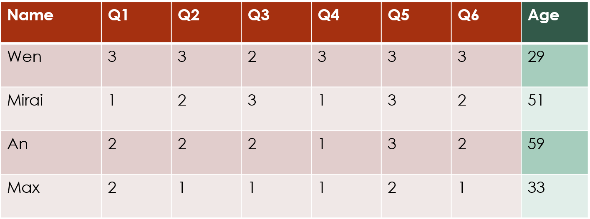
```

The above example shows row covariates, i.e. additions to the model that will be indexed by $i$. In this case, the covariate is a **numerical** covariate that gives the age of each survey respondent. 

### Data format for covariates

If you want to use covariates, they have to be added to the long form data frame that will be used in the clustering. You can feed them in to the `mat2df()` function along with the original data matrix, and that function will automatically add them to the long form data frame.

The example below simulates an age covariate for the survey dataset and includes it in the long form data frame.

If you are adding covariates for the **rows** of the data matrix, i.e. covariates that take different values for the different rows, then you need to supply them using the `xr.df` argument to `mat2df()`. You can add as many covariates as you like, both numerical and categorical, just as if you were setting up a data frame for regression analysis. The `mat2df()` function will handle converting any categorical covariates to dummy variables, just as `lm()` and `glm()` do.

```{r}
age.df <- data.frame(age=round(runif(nrow(df), min=20, max=60)))

long.df <- mat2df(df, xr.df=age.df)
```

If you are instead adding covariates for the **columns** of the data matrix, i.e. covariates that take different values for the different columns, then you need to supply them using the `xc.df` argument to `mat2df()`, although again you can add as many numerical or categorical covariates as you like.

The example below simulates a covariate for the columns of the survey dataset, and adds that and the age covariate to the long form data frame.

```{r}
question.df <- data.frame(question=sample(c("Group A","Group B"), ncol(df), replace=TRUE))

long.df <- mat2df(df, xr.df=age.df, xc.df=question.df)
```

### Fitting a model with covariates

Adding the covariates to the model is just like adding covariates to a regression model: you include them in the formula, and you can also add interactions with the clusters or functions of the covariates such as logs or powers.

This example performs row clustering with the addition of the age and question covariates. The covariate names **must match** the names they had in their original data frames.

```{r, eval=FALSE}
fit_with_covariates <- clustord(Y ~ ROWCLUST + age + question, model="POM",
                                nclus.row=2, long.df=long.df, verbose=FALSE)
```

```{r}
fit_with_covariates$EM.status$converged

fit_with_covariates$RowClusterMembers

fit_with_covariates$parlist.out
```
Within the parameter output object are the $\{\mu_k\}$ parameters discussed below in the ordinal models section, and the row cluster effects `rowc`. Then the `cov` parameters are the effects of the two covariates.

The first covariate, `age`, is numerical so the covariate corresponds to the effect of a 1 unit increase in the covariate value. 

The second covariate, `question`, is categorical and the first level alphabetically, "Group A", will be the reference level so the coefficient shows the effect of being Group B instead of Group A.

Note that whilst you can include interactions between covariates and ROWCLUST or COLCLUST in the formula, these are not quite the same as interactions between covariates. The formula

~~~
Y ~ ROWCLUST*xr
~~~

where `xr` is some row covariate has, as the main part of its linear predictor,

~~~
rowc_coef_r + rowc_row_coef_r1*xr_i + cov_coef*xr_i
~~~

What this means is that there is a term in the linear predictor that involves the row covariate `xr` (which has the index i because it is a row covariate), and each cluster (indexed by r) has a different coefficient for that covariate (as distinct from the non-interaction covariate models above, which have the same coefficients for the covariates regardless of which cluster the row is in).

This is slightly different from interaction terms involving only covariates, where two or more covariates appear multiplied together in the model and then have a shared coefficient term. The example below shows the formula and the main part of the linear predictor for a model with a row and column covariate interacting: they then have a coefficient for their interaction term.
~~~
Y ~ ROWCLUST + xr*xc
rowc_coef_r + cov_coef1*xr_i + cov_coef2*xc_j + cov_coef1*xr_i*xc_j
~~~

Also note that you can include first-level interactions with `ROWCLUST` and `COLCLUST`, you cannot fit third-level interactions between a covariate and `ROWCLUST` **and** `COLCLUST`. That is, terms like `x:ROWCLUST:COLCLUST` are **not** permitted in `clustord`, due to the number of parameters that would need to be fitted. 

# Label switching

The clusters in `clustord` output will be labelled 1, 2, 3, etc. but these numbers are meaningless. A result with clusters labelled 1, 2, 3, 4 is mathematically equivalent to other results with clusters numbered 2, 1, 4, 3 or 3, 1, 2, 4, etc. The only things that genuinely distinguish one cluster from another are the cluster parameters and the estimated probabilities of membership in the clusters.

Due to the random starting points, two runs of `clustord` with the same parameters can produce different results, unless you fix the random number seed first using `set.seed()`. So if you run `clustord()` once for e.g. three row clusters, and find that the `rowc` parameters (i.e. the main clustering effects) are (-1.2, 1.4 and 0.2) and then you run it again and find that the parameters are now (-0.3, -1.1, 1.4), then the sets of parameter values are roughly the same, just in a different order. The change in cluster order is **meaningless** -- it is simply "label switching" in action. 

Similarly, if you have one run with 3 clusters and another run with 4 clusters, and one has parameters (1.4, 0.1 and -1.5) while the other has parameters (0.2, -0.4, 1.3 and -1.5) then the first cluster of the 3-cluster results may be roughly equivalent to the third cluster of the 4-cluster results, and so on. It's worth also checking the lists of cluster members to see if the clusters with similar parameters have similar lists of members, but if they are then you can conclude that that part of the clustering model remained roughly consistent even when another cluster was added to the model.

If you have multiple sets of results (for example, the results from different models) and you want to compare their parameter estimates, then a simple way to make them a bit more consistent is to relabel the parameters in increasing order of the cluster main effect. So if they're row clusters, relabel them in order of increasing `rowc` values and if they're column clusters, relabel them in order of increasing `colc` values from `...\$parlist.out`. 

# A note about notation

If you are looking at the cited journal articles by Pledger and Arnold (2014), Matechou et al. (2016), and Fernández et al. (2016 and 2019), the notation in those is slightly different than the notation used in this tutorial. The package and tutorial notation was changed to reduce confusion between the parameters in the row clustering and column clustering models.

Table 2 is a glossary of the notation used in `clustord` and the corresponding notation used in the articles.

\begin{table}
\label{tb:notation}
\caption{Comparison of \texttt{clustord} notation with the notation used in the original journal articles.}
\begin{tabular}{ll}
\hline

$\alpha_r$  & \texttt{rowc} \\

$\beta_j$  & \texttt{col} \\

$\gamma_{rj}$ &  \texttt{rowc\_col}\\

$\beta_c$  &   \texttt{colc} \\

$\alpha_i$  &  \texttt{row} \\

$\gamma_{ic}$  & \texttt{colc\_row} \\

$\gamma_{rc}$  & \texttt{rowc\_colc} \\

\end{tabular}
\end{table}

The rest of the parameters retain the same names in this tutorial and the cited references. 

Note also that, although it is theoretically possible in this model structure to add $\alpha_r$ and $\alpha_i$ to the same model, ie. row cluster effects **and** individual row effects, `clustord` does not allow this, and will warn you if you try to use `Y ~ ROWCLUST + ROW` or similar formulae. And the biclustering model, which has $\alpha_r$ and $\beta_c$, does not allow either individual row or individual column effects, partly because this would introduce too many parameters and be too difficult to fit correctly.


# References

Agresti, A. (2010). *Analysis of ordinal categorical data*. Vol. 656, John Wiley & Sons.

Akaike, H. (1973). Maximum likelihood identification of Gaussian autoregressive moving average models. Biometrika, 60(2), 255-265.

Anderson, J. A. (1984). Regression and ordered categorical variables. *Journal of the Royal Statistical Society -- Series B (Methodological)*, pp. 1--30.

Biernacki, C., Celeux, G., Govaert, G. (2000). Assessing a mixture model for clustering with the integrated completed likelihood. *IEEE Trans. Pattern Analysis and Machine Intelligence*, **22**(7), 719-725.

Dempster, A. P., Laird, N. M. and Rubin, D. B. (1977). Maximum likelihood from incomplete data
via the EM algorithm. *Journal of the Royal Statistical Society. Series B (Methodological)*, **39**, pp. 1--22.

Fernández, D., Arnold., R. and Pledger, S. (2016). Mixture-based clustering for the ordered stereotype model. *Computational Statistics & Data Analysis*, **93**, pp. 46--75.

Fernández, D., Arnold, R., Pledger, S., Liu, I., & Costilla, R. (2019). Finite mixture biclustering of discrete type multivariate data. *Advances in Data Analysis and Classification*, **13**, pp. 117--143.

Jacques, J. and Biernacki, C. (2018). Model-based co-clustering for ordinal data. *Computational Statistics & Data Analysis*, **123**, pp. 101--115.

Lloyd, S. P. (1982). Least squares quantization in PCM. *IEEE Transactions on Information Theory*, **28**(2), pp. 129--137.

MacQueen, J. B. (1967). Some Methods for classification and Analysis of Multivariate Observations. *Proceedings of 5th Berkeley Symposium on Mathematical Statistics and Probability. University of California Press*, **1**(14), pp. 281--297. 

Matechou, E., Liu, I., Fernández, D. Farias, M., and Gjelsvik, B. (2016). Biclustering models for two-mode ordinal data. *Psychometrika*, **81**, pp. 611--624.

McLachlan, G. J. and Basford, K. E. (1988) *Mixture Models: Inference and Applications to Clustering.* Marcel Dekker, New York.

McLachlan, G. J. and Krishnan, T. (2007). *The EM algorithm and extensions*, (Vol. 382). John Wiley
& Sons.

McLachlan, G. J. and Peel, D. (2000). *Finite Mixture Models*, (Vol. 299). John Wiley & Sons.

O'Neill, R. and Wetherill, G. B. (1971). The present state of multiple comparison methods (with discussion). *Journal of the Royal Statistical Society (B)*, **33**, pp. 218--250.

Pledger, S. and Arnold, R. (2014). Multivariate methods using mixtures:
Correspondence analysis, scaling and pattern-detection. 
*Computational Statistics and Data Analysis* **71**, pp. 241--261.

Schwarz, G. E. (1978). Estimating the dimension of a model. *Annals of Statistics*, **6**(2): 461–464, doi:10.1214/aos/1176344136.

